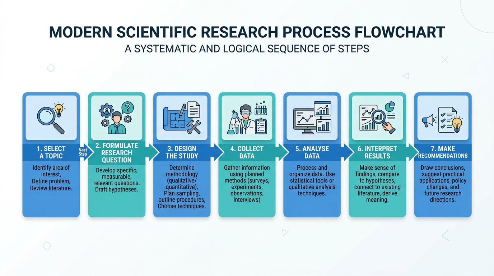

## What is Science? {#sec-science}

Now let’s turn to the first topic: **research fundamentals**. No equations today: just the ideas that have shaped how we produce reliable knowledge.

### A Human Invention

Science is not something that has always existed; it is a **social institution**, created by humans. For most of history, people used pre‑scientific methods (oracles, mysticism, magic) to explain the world. Even in the 21st century, we sometimes mistake coincidence for causation.  

Remember the “World Cup octopus” of 2010? It “predicted” match winners by choosing food from a flag‑decorated box. Pure luck looked like skill, but no one could explain *why* it worked; that is not science.

::: {.callout-note}
## How recent is modern science?
Written history spans roughly **300 generations** (about 6000 years). Yet before 1492, people believed all important knowledge had already been discovered.  
Modern science was invented between **1572** (Tycho Brahe saw a nova) and **1704** (Newton’s *Opticks*).
:::

### Giants Who Shaped Science

- **Tycho Brahe**: Danish nobleman, obsessive observer, lost part of his nose in a duel over mathematics. His data later enabled Kepler’s breakthroughs.
- **Johannes Kepler**: Brahe’s assistant; used Brahe’s huge dataset to derive the laws of planetary motion. Regarded as the father of modern astronomy.
- **Galileo Galilei**: Championed empirical evidence; father of modern physics.
- **Francis Bacon**: Invented the **scientific method** itself. He insisted that facts, empirical evidence, and testable hypotheses must replace pure logical deduction (like the syllogisms of Aristotle).

::: {.callout-tip}
Biographies of scientists are both entertaining and inspiring. I highly recommend reading Tycho Brahe’s story: he “lived like a sage and died like a fool”.
:::

### What Science *Is* (and Isn’t)

**Science** is both:

- A **system** for producing knowledge, and
- The **knowledge** produced by that system.

It organises knowledge into **theories**. As researchers we collect data and use specialised techniques to *support* or *reject* hypotheses; we rarely “prove” anything absolutely.

> **A crucial insight**: Scientific inquiry is **not** a search for absolute truth. Our goal is to move *closer* to the truth, demonstrating that our methods and conclusions are *better than existing ones*, rather than perfect forever.  
> When Newton described motion, people thought they had the final answer. Then Einstein came. Today we trust Einstein, but in another 100 years … who knows?

### The Norms of Science (Mertonian Norms)

Robert Merton (1942) gave us four principles that keep science honest:

1. **Communism**: Common ownership of knowledge; share results openly.
2. **Universalism**: Validity of a claim does **not** depend on the scientist’s race, nationality, or status.
3. **Disinterestedness**: Avoid emotional attachment to a specific outcome; be ready to accept failure.
4. **Organised scepticism**: All claims must survive rigorous, critical scrutiny by the community.

::: {.callout-warning}
## Activity: Scientific misconduct in the news
Search the internet for a recent case of academic misconduct or a research scandal.  
If possible, find a story from your own country.  
Be prepared to share it with the class.

*Examples mentioned in past classes:*

- A British doctor fabricated a link between the MMR vaccine and autism (tiny sample, manipulated timelines).
- A PhD thesis in China was found to be largely plagiarised.
- UWA professors inadvertently cited a plagiarised law paper.
:::

These norms are easy to agree with on paper, but scientists are human. Regularly reminding ourselves of them helps avoid the many scandals we still see in the news.

---

## The Scientific Method

The scientific method is an **empirical** method: it demands **data**. A beautiful theory means nothing without evidence.  
This approach was formalised by **Francis Bacon**, replacing the older Aristotelian *syllogism* (a three‑part deductive argument). A syllogism can be correct in form but still produce nonsense:

- Premise 1: “All humans are mortal.” (Premise 2: “Socrates is human.” (Conclusion: “Socrates is mortal.” ✅ (reasonable)

But without empirical grounding it can go wrong:

- Premise 1: “I am nobody.” (Premise 2: “Nobody is perfect.” (Conclusion: “I am perfect.” 😕

The scientific method adds the missing ingredient: **observation** → **hypothesis** → **test with data** → **accept / reject**.

In this course you will use **R** (an open‑source statistical language) to carry out such tests on real engineering datasets. We’ll start with simple descriptive analysis and build up to linear regression and optimisation.

---

## Where to go from here

- **Tomorrow**: First tutorial - **bring your laptop with R and RStudio installed**.
- **Next lecture**: We’ll dive deeper into the research process: literature reviews, hypotheses, and how to design a study.
- **Readings**: Check Blackboard for this week’s materials and the recommended textbooks (you do not need to buy them; the library has copies).


## From Science to Research

In @sec-science we saw that science is a social institution that relies on empirical evidence and sceptical scrutiny. **Research** is the hands‑on activity that puts science into practice.

The word itself says it all: **re‑search**: Searching again and again for evidence, patterns, and answers.  
Research is a *structured inquiry* that uses acceptable scientific methodology to solve problems and create new, generally applicable knowledge.

::: {.callout-note}
## Research ≠ casual exploration
Not every investigation qualifies as scientific research. To earn the label, a study must meet five essential criteria. Missing even one of them undermines the reliability of the results.
:::

## Five Criteria for Scientific Research

For an activity to be called scientific research, it must be:

1. **Controlled**  
   You must identify the factors that could influence your outcome and *control* for those you are not studying.  
   *Example*: When testing a new COVID vaccine, you recruit a control group (placebo) and a treatment group. By randomly assigning participants, you isolate the effect of the vaccine. Any difference in outcomes can then be attributed to the drug, not to age, health status, or other confounding variables.

2. **Rigorous**  
   Rigour means following a careful, logical plan. Every step, from data collection to analysis, must be justified and documented. Sloppy procedures lead to sloppy conclusions.

3. **Systematic**  
   A systematic study follows an established sequence of steps (see @fig-research-process). You don’t “freestyle” research; you follow a recognised process that the community accepts.

4. **Verifiable**  
   Other researchers must be able to check your results. This means sharing your data, your code, and your methods. If you propose a hypothesis but have no way to verify it, your study cannot be trusted.  
   *Practical implication*: Before choosing a research question, ask yourself - *“Do I have (or can I collect) data that will allow me to test this hypothesis?”* If the answer is *no*, the question is not feasible.

5. **Empirical**  
   Your conclusions must be grounded in observation or experiment, not in pure logic or opinion. No matter how elegant your theory, without data it remains speculation.

::: {.callout-tip}
## The five criteria in one sentence
A scientific study is **controlled**, **rigorous**, **systematic**, **verifiable**, and **empirical** -  *CRSVE* if you need a mnemonic.
:::

## The Research Process: A Step‑by‑Step Flow

Every research project, regardless of discipline, follows a similar life‑cycle. The diagram below captures the main stages.

```{mermaid}
flowchart TD
  A[Select a topic] --> B[Formulate research question]
  B --> C[Design the study]
  C --> D[Collect data]
  D --> E[Analyse data]
  E --> F[Interpret results]
  F --> G[Make recommendations]
  
  F -->|if findings suggest new questions| B
  E -->|if data quality issues| D
```

{#fig-research-process}

Notice the feedback loops: if your analysis reveals poor data quality, you may need to go back and collect better data. If your results open up new questions, you might refine your original research question and start the cycle again. Real research is rarely a straight line.

### Two Crucial Points in This Flow

While every step matters, I want to draw your attention to two that often trip up beginners (and sometimes experienced researchers too).

#### 1. Selecting a Topic → the role of the **literature review**

You might know your broad area of interest (such as *autonomous vehicles*, *renewable energy*, or *water treatment*). But these are enormous fields. How do you narrow them down to a specific, researchable topic?  
The answer: **read the literature**.

- A thorough literature review tells you what has already been done.
- It reveals gaps, contradictions, and unanswered questions.
- It shows you which methods are commonly used and what kind of data is available.
- It helps you avoid reinventing the wheel (or worse, repeating a study that has already been done).

::: {.callout-important}
## My advice to PhD students
When a new student joins my group, I ask them to do **nothing but read papers for the first 3 to 6 months**. They may feel frustrated (“When can I start my own research?”), but this deep immersion is what eventually leads to a sharp, original research question.  
We’ll devote an entire lecture to the art of conducting a literature review later in the semester.
:::

#### 2. Keeping **theory** in mind at every step

Theory is the glue that holds the whole process together.  
Whether you are selecting a topic, designing an experiment, or interpreting your regression coefficients, you must constantly ask yourself: *“What does my theory predict? Am I measuring the right variables? Does my interpretation align with the underlying mechanisms?”*

If you lose sight of theory, you risk producing results that are statistically significant but meaningless, or even misleading.

*In the next lecture I will share a real‑world example that illustrates just how dangerous it is to forget the theory behind your research. Stay tuned.*

---

## Before You Leave

- **Tomorrow’s tutorial**: Bring your laptop with R and RStudio installed. The first session will get you comfortable with the environment.
- **Next lecture**: We will build on today’s foundation and go deeper into how to formulate research questions, develop testable hypotheses, and write a professional research proposal.
- **Reading**: The recommended textbook *Research Design: Qualitative, Quantitative, and Mixed Methods Approaches* by Creswell & Creswell has an excellent chapter on the research process. Check it out on Blackboard.

> *Remember: research is a craft. The more you practice the steps deliberately, the more instinctive they become. See you tomorrow at the tutorial!*
