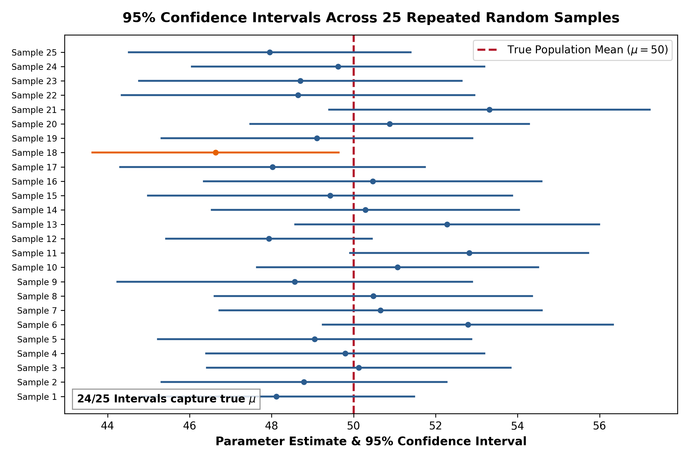
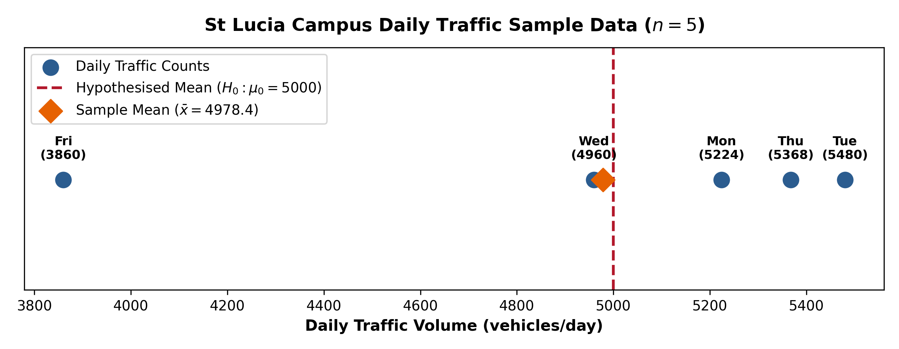
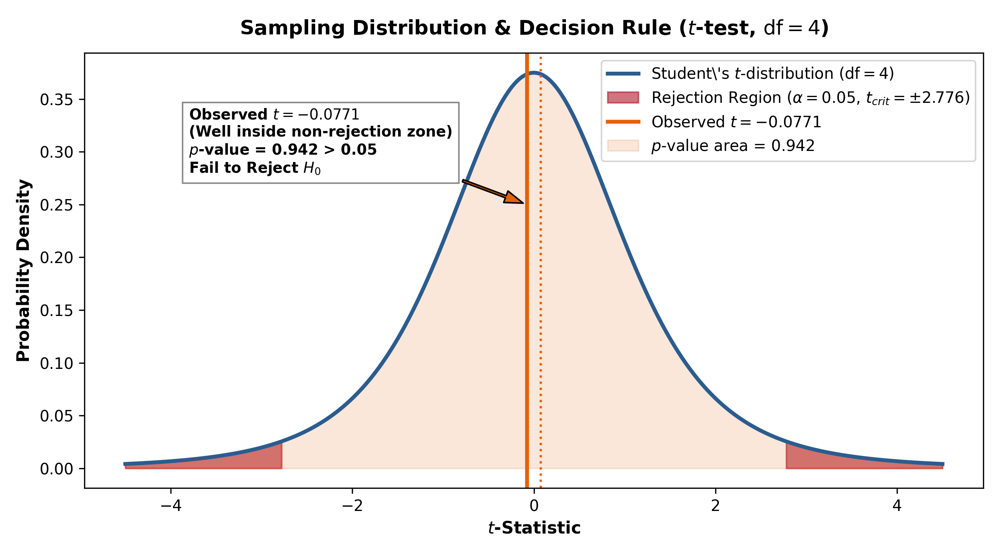
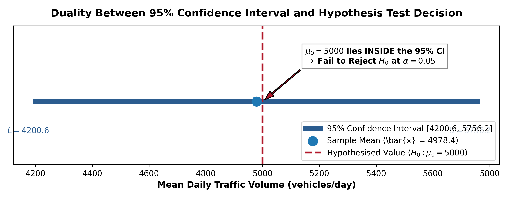
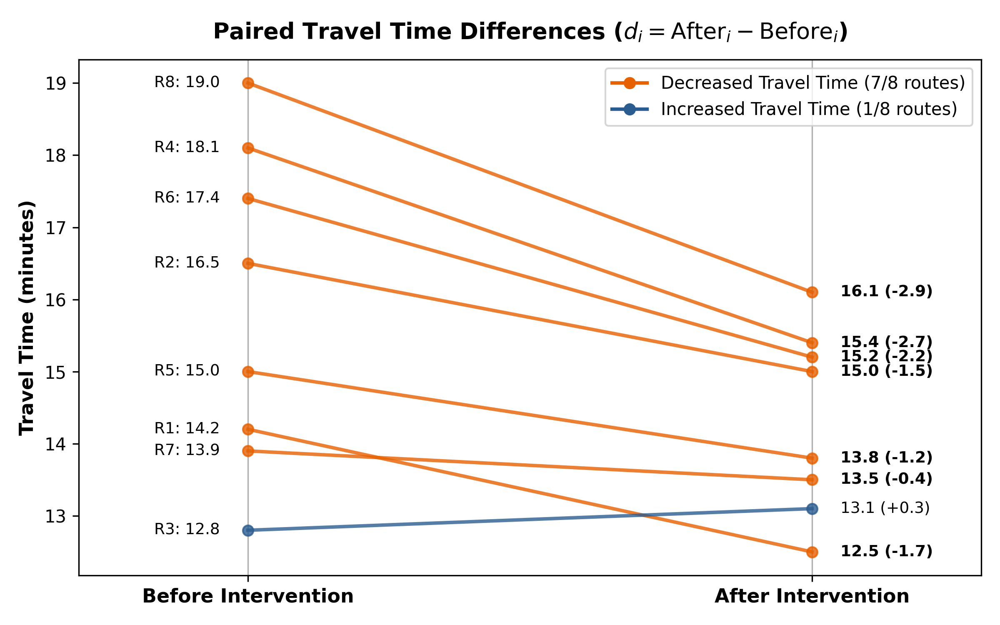
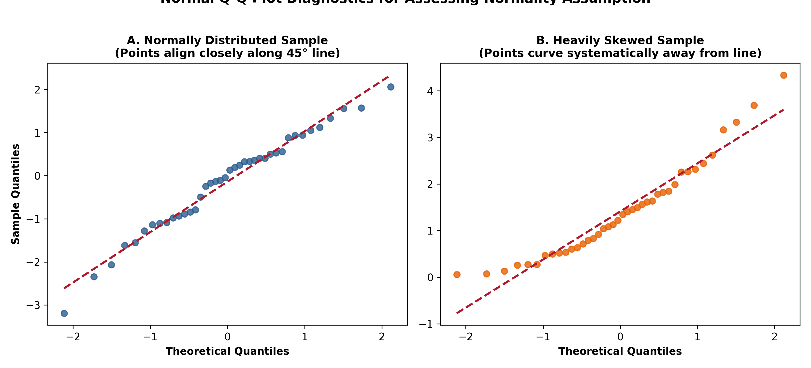

> *“We are what we repeatedly do. Excellence, therefore, is not an act but a habit.”*  
> — Aristotle

## Introduction

Chapter 4 laid the groundwork of statistical thinking by covering population versus sample, descriptive statistics, the normal distribution, sampling distributions, confidence intervals, and the bootstrap. This chapter takes the next crucial step by addressing a fundamental research question:

> *“Given what I observe in my sample, can I conclude that a true effect exists in the population, or could the observed result simply be due to random chance?”*

This question forms the core of **hypothesis testing**. This chapter explores the conceptual foundations of statistical inference and introduces **t-tests**, the most widely used family of hypothesis tests for comparing means.

By the end of this chapter, you will be able to:

1. Formulate null ($H_0$) and alternative ($H_A$) hypotheses for engineering research questions.
2. Understand Type I ($\alpha$) and Type II ($\beta$) errors and the role of the significance level.
3. Carry out a complete hypothesis test using a unified 5-step $p$-value workflow.
4. Select, compute, and interpret one-sample, paired, and two-sample t-tests in R.
5. Explain the dual relationship between confidence intervals and hypothesis tests.
6. Evaluate the statistical assumptions underlying t-tests and distinguish statistical significance from practical significance.

---

## Review: Confidence Intervals and Their Interpretation

Before introducing hypothesis testing, it is valuable to review the precise interpretation of a confidence interval.

A **95% confidence interval** for a population parameter (such as the population mean $\mu$) is an interval calculated from sample data such that, in repeated sampling under identical conditions, **95% of such intervals will capture the true population parameter**.

A correct summary statement is: *"We are 95% confident that the true population mean lies between L and U."*

### Three Common Misinterpretations to Avoid

1. ❌ *"A 95% confidence interval contains 95% of the data points in the population."*  
   **Incorrect.** The confidence interval estimates the location of a population parameter, not the spread of individual observations.

2. ❌ *"There is a 95% chance that a future sample mean will fall inside this interval."*  
   **Incorrect.** The interval is constructed around the current sample mean; the 95% level describes the long-run reliability of the estimation procedure for capturing the fixed population mean.

3. ❌ *"The probability that the true population mean lies inside this specific calculated interval is 0.95."*  
   **Technically incorrect.** The population parameter is a fixed, unknown constant. For a specific calculated interval (e.g., $[4.2, 8.6]$), the parameter is either inside the interval or it is not; the probability is strictly 0 or 1. The "95%" refers to the long-run success rate of the methodology.

The standard textbook phrasing remains: *"We are 95% confident that the calculated interval captures the true population parameter."*

{#fig-ci-sampling}

---

## Hypothesis Testing: The Logic of Refutation

At its foundation, scientific hypothesis testing relies on **refutation**. A research claim about a population cannot be conclusively proven true by empirical observation alone, but empirical evidence can contradict and disprove a claim. When contradictory sample evidence becomes sufficiently strong, the initial claim is rejected.

Consider the classic philosophical example: *"All swans are white."* For centuries, European observers assumed this statement was universally true, until black swans were observed in Australia. A single contradictory observation refuted the universal hypothesis.

In statistical analysis, this logic of refutation is formalized through competing statistical hypotheses.

### Null and Alternative Hypotheses

Every hypothesis test establishes two mutually exclusive statements:

- **Null Hypothesis ($H_0$):** The baseline or "status quo" statement assuming no effect, no difference, or no change in the population. We assume $H_0$ is true unless the sample evidence convincingly contradicts it.
- **Alternative Hypothesis ($H_A$):** The research statement we suspect may be true, representing an effect, a parameter shift, or a real difference between groups.

For example, when testing whether a coin is fair:

- $H_0: p = 0.5$ (The coin is fair; probability of heads is 0.5).
- $H_A: p \neq 0.5$ (The coin is biased).

An alternative hypothesis can be **two-sided** (specifying a difference in either direction, $p \neq 0.5$) or **one-sided** (specifying a direction, such as $p > 0.5$). The decision to use a one-sided or two-sided test must be established prior to data inspection based on the underlying research question.

### Running Example: Daily Campus Traffic Volume

To illustrate the concepts throughout this chapter, consider a study on daily traffic volume at the St Lucia university campus. Suppose a transport manager hypothesises that the long-term mean daily traffic volume is $\mu_0 = 5000$ vehicles per day.

To test this claim, traffic counts are recorded over five randomly selected weekdays ($n = 5$):
$$\text{Traffic counts (vehicles/day): } [5224, 5480, 4960, 5368, 3860]$$

From these sample data, we calculate the summary statistics:
$$\text{Sample mean } (\bar{x}) = 4978.4 \text{ vehicles/day}$$
$$\text{Sample standard deviation } (s) = 626.54 \text{ vehicles/day}$$

{#fig-traffic-dotplot}

We formulate the competing hypotheses to test whether the true population mean ($\mu$) differs from 5000:

$$H_0: \mu = 5000 \qquad \text{versus} \qquad H_A: \mu \neq 5000$$

Here, $\mu$ represents the true, unknown long-term mean daily traffic volume, and $\bar{x} = 4978.4$ is our point estimate derived from the sample.

---

## Type I and Type II Errors

Because statistical inference relies on incomplete sample data, decision-making involves inherent risk. Two types of errors can occur:

| Decision Made | $H_0$ is True in Reality | $H_A$ is True in Reality |
| :--- | :--- | :--- |
| **Reject $H_0$** | **Type I Error** (False Positive) | Correct Decision (Power = $1 - \beta$) |
| **Fail to Reject $H_0$** | Correct Decision ($1 - \alpha$) | **Type II Error** (False Negative) |

- **Type I Error ($\alpha$):** Rejecting the null hypothesis when it is actually true. The probability of making a Type I error is controlled by selecting a **significance level** ($\alpha$), typically set to $\alpha = 0.05$, $0.01$, or $0.001$.
- **Type II Error ($\beta$):** Failing to reject the null hypothesis when the alternative hypothesis is actually true. The probability of correctly rejecting a false null hypothesis ($1 - \beta$) is termed the **statistical power** of the test.

::: {.callout-tip}
## Conceptual Analogy for Errors
In a medical diagnostic test:
- A healthy patient diagnosed as ill represents a **Type I error** (false positive).
- An ill patient diagnosed as healthy represents a **Type II error** (false negative).

In judicial trials, assuming innocence ($H_0$): convicting an innocent person is a Type I error, while acquitting a guilty person is a Type II error.
:::

---

## The Unified 5-Step Hypothesis Testing Workflow

Modern data analysis combines theoretical hypothesis testing with the **$p$-value approach** into a systematic 5-step workflow.

> **Definition:** The **$p$-value** is the probability of obtaining a test statistic as extreme as, or more extreme than, the value observed from the sample data, **assuming that the null hypothesis ($H_0$) is true**.

### The 5-Step Workflow

1. **State the Hypotheses:** Define $H_0$ and $H_A$ clearly using population parameters ($\mu$).
2. **Select the Significance Level ($\alpha$):** Choose $\alpha$ (e.g., $\alpha = 0.05$) before inspecting the data.
3. **Identify the Sampling Distribution & Test Statistic:** Select the appropriate test statistic (such as Student's $t$) based on data structure and assumptions.
4. **Compute the Test Statistic and $p$-Value:** Calculate the test statistic from sample data and determine the corresponding $p$-value from its sampling distribution.
5. **Make a Decision and State the Conclusion:**
   - If $p\text{-value} \le \alpha$, **reject $H_0$**. The sample evidence is incompatible with $H_0$.
   - If $p\text{-value} > \alpha$, **fail to reject $H_0$**. The sample evidence is plausible under $H_0$.

::: {.callout-warning}
## Avoiding $p$-Hacking: Pre-registering $\alpha$
It is an unacceptable practice to adjust the significance level $\alpha$ after observing the $p$-value (for instance, raising $\alpha$ from $0.05$ to $0.10$ to label a $p = 0.07$ result as "significant"). Responsible research requires establishing $\alpha$ and analysis protocols prior to data examination to prevent false positives and $p$-hacking.
:::

### Applying the 5-Step Workflow to the Traffic Study

We now apply this workflow to the St Lucia campus traffic dataset ($n = 5, \bar{x} = 4978.4, s = 626.54$):

**Step 1: State Hypotheses**
$$H_0: \mu = 5000 \qquad \text{vs.} \qquad H_A: \mu \neq 5000$$

**Step 2: Select Significance Level**
$$\alpha = 0.05$$

**Step 3: Sampling Distribution & Test Statistic**
Because the population standard deviation $\sigma$ is unknown and sample size is small ($n = 5$), we use the one-sample $t$-statistic, which follows a Student's $t$-distribution with $\text{df} = n - 1 = 4$ under $H_0$:
$$t = \frac{\bar{x} - \mu_0}{s / \sqrt{n}}$$

**Step 4: Compute Test Statistic & $p$-Value**
$$\text{Standard Error (SE)} = \frac{s}{\sqrt{n}} = \frac{626.54}{\sqrt{5}} = 280.20$$
$$t = \frac{4978.4 - 5000}{280.20} = \frac{-21.6}{280.20} = -0.0771$$

Using a Student's $t$-distribution with $4$ degrees of freedom, the two-tailed $p$-value represents the probability of observing a $t$-statistic further from zero than $\pm 0.0771$:
$$p\text{-value} = P(|t_4| \ge 0.0771) \approx 0.942$$

{#fig-t-dist-pvalue}

**Step 5: Decision and Conclusion**
Since $p\text{-value} = 0.942 > \alpha = 0.05$, we **fail to reject $H_0$**. There is insufficient statistical evidence to conclude that the mean daily traffic volume on the campus differs from 5000 vehicles per day.

---

## Duality of Confidence Intervals and Hypothesis Tests

Confidence intervals and hypothesis tests share the same underlying statistical foundation. For a two-sided test at significance level $\alpha$, there is an exact mathematical duality with a $(1 - \alpha)\%$ confidence interval:

- If the null-hypothesised value $\mu_0$ falls **inside** the $(1 - \alpha)\%$ confidence interval, the two-tailed test will **fail to reject $H_0$** at significance level $\alpha$ ($p > \alpha$).
- If $\mu_0$ falls **outside** the $(1 - \alpha)\%$ confidence interval, the two-tailed test will **reject $H_0$** at significance level $\alpha$ ($p \le \alpha$).

### Demonstration with Campus Traffic Data

Using the St Lucia traffic data ($n = 5, \bar{x} = 4978.4, SE = 280.20$), the critical $t$-value for a 95% confidence interval with $\text{df} = 4$ is $t_{0.025, 4} = 2.776$.

$$\text{95\% CI} = \bar{x} \pm t_{crit} \times SE = 4978.4 \pm (2.776 \times 280.20) = 4978.4 \pm 777.8 = [4200.6, \; 5756.2]$$

{#fig-ci-duality}

Because the null value $\mu_0 = 5000$ lies comfortably inside the range $[4200.6, 5756.2]$, the 95% confidence interval confirms our test decision: we fail to reject $H_0$. 

Note that with only five days of data ($n = 5$), the estimate is relatively imprecise, yielding a wide confidence interval. A larger sample size would narrow the interval and increase statistical power to detect smaller true departures from 5000 vehicles per day.

Confidence intervals provide more informative output than a simple pass/fail decision, as they display the full range of plausible values for the population parameter alongside the point estimate.

*(Note: The duality described here applies strictly to two-sided tests. For one-sided hypothesis tests, the mathematical duality corresponds to a one-sided confidence bound, such as an upper or lower 95% confidence limit).*

---

## The $t$-Test Family: Comparing Means

A **$t$-test** is a formal hypothesis test where the test statistic follows Student's $t$-distribution under $H_0$. All $t$-tests share a common structural formula based on a signal-to-noise ratio:

$$t = \frac{\text{Signal}}{\text{Noise}} = \frac{\text{Observed Difference}}{\text{Standard Error of Difference}}$$

- **Signal (Numerator):** The magnitude of the observed difference between a sample mean and a benchmark value, or between two sample means.
- **Noise (Denominator):** The standard error, capturing sampling variability. High variance decreases the $t$-ratio, requiring a larger observed difference to achieve statistical significance.

### 1. One-Sample $t$-Test

The one-sample $t$-test compares a single sample mean $\bar{x}$ against a known or theoretical benchmark $\mu_0$.

$$\text{Test statistic: } t = \frac{\bar{x} - \mu_0}{s / \sqrt{n}}, \qquad \text{df} = n - 1$$

#### R Implementation

In R, the one-sample $t$-test is executed using `t.test()`:

```r
# St Lucia campus traffic data
traffic_counts <- c(5224, 5480, 4960, 5368, 3860)

# Run one-sample t-test against mu0 = 5000
test_result <- t.test(traffic_counts, mu = 5000, alternative = "two.sided")
print(test_result)
```

**R Output Summary:**
```text
	One Sample t-test

data:  traffic_counts
t = -0.077089, df = 4, p-value = 0.9422
alternative hypothesis: true mean is not equal to 5000
95 percent confidence interval:
 4200.569 5756.231
sample estimates:
mean of x 
   4978.4 
```

### 2. Paired $t$-Test

A paired $t$-test is applied when observations occur in **matched pairs** (such as before-and-after measurements on the same experimental units, or paired sensors). The analysis transforms the pairs into a single sample of differences $d_i = y_i - x_i$.

For a paired $t$-test, the theoretical assumptions (such as approximate normality for small sample sizes) apply directly to the sample of differences ($d_i$), rather than to the individual raw measurements ($x_i$ or $y_i$).

#### Example: Traffic Signal Re-timing Trial
Suppose travel times (in minutes) are recorded for 8 vehicle routes before and after a traffic signal re-timing algorithm is deployed:

| Route | Before ($x_i$) | After ($y_i$) | Difference ($d_i = y_i - x_i$) |
| :--- | :--- | :--- | :--- |
| 1 | 14.2 | 12.5 | -1.7 |
| 2 | 16.5 | 15.0 | -1.5 |
| 3 | 12.8 | 13.1 | +0.3 |
| 4 | 18.1 | 15.4 | -2.7 |
| 5 | 15.0 | 13.8 | -1.2 |
| 6 | 17.4 | 15.2 | -2.2 |
| 7 | 13.9 | 13.5 | -0.4 |
| 8 | 19.0 | 16.1 | -2.9 |

We test whether re-timing significantly reduces travel time ($H_0: \mu_d = 0$ vs. $H_A: \mu_d < 0$).

$$\text{Sample mean difference } (\bar{d}) = -1.538 \text{ min}, \quad s_d = 1.097 \text{ min}, \quad n = 8$$
$$t = \frac{\bar{d} - 0}{s_d / \sqrt{n}} = \frac{-1.538}{1.097 / \sqrt{8}} = -3.96, \quad \text{df} = 7 \implies p\text{-value} = 0.0027$$

{#fig-paired-travel}

Because $p = 0.0027 < 0.05$, we reject $H_0$ and conclude that signal re-timing significantly reduces travel time.

#### R Implementation

```r
before <- c(14.2, 16.5, 12.8, 18.1, 15.0, 17.4, 13.9, 19.0)
after  <- c(12.5, 15.0, 13.1, 15.4, 13.8, 15.2, 13.5, 16.1)

# Paired t-test
t.test(after, before, paired = TRUE, alternative = "less")
```

### 3. Two-Sample Independent $t$-Test

The two-sample $t$-test compares the population means of two **independent** groups ($\mu_1$ and $\mu_2$).

$$H_0: \mu_1 = \mu_2 \qquad \text{vs.} \qquad H_A: \mu_1 \neq \mu_2$$

#### Pooled Variance vs. Welch's $t$-Test
- **Student's Two-Sample $t$-Test:** Assumes equal population variances ($\sigma_1^2 = \sigma_2^2$). Uses a pooled standard deviation $s_p$:
  $$t = \frac{\bar{x}_1 - \bar{x}_2}{s_p \sqrt{\frac{1}{n_1} + \frac{1}{n_2}}}, \qquad s_p = \sqrt{\frac{(n_1-1)s_1^2 + (n_2-1)s_2^2}{n_1 + n_2 - 2}}, \qquad \text{df} = n_1 + n_2 - 2$$
- **Welch's $t$-Test:** Does not assume equal variances. It modifies the standard error formula and adjusts degrees of freedom using the Welch–Satterthwaite equation. **Welch's test is the default in R (`var.equal = FALSE`)** because it maintains robust Type I error control under variance heterogeneity.

#### Worked Example: Concrete Compressive Strength
Consider testing compressive strength (MPa) between two concrete mix designs ($n_1 = 6, n_2 = 6$):
$$\text{Batch A: } [32.4, 34.1, 31.8, 33.5, 35.0, 32.9] \implies \bar{x}_A = 33.283 \text{ MPa}, \; s_A = 1.151 \text{ MPa}$$
$$\text{Batch B: } [28.5, 29.8, 30.2, 31.0, 27.9, 29.4] \implies \bar{x}_B = 29.467 \text{ MPa}, \; s_B = 1.152 \text{ MPa}$$

We test $H_0: \mu_A = \mu_B$ vs $H_A: \mu_A \neq \mu_B$ at $\alpha = 0.05$.

$$\text{Difference } (\bar{x}_A - \bar{x}_B) = 3.816 \text{ MPa}$$
$$\text{Welch } SE = \sqrt{\frac{s_A^2}{n_1} + \frac{s_B^2}{n_2}} = \sqrt{\frac{1.326}{6} + \frac{1.326}{6}} = 0.665 \text{ MPa}$$
$$t = \frac{3.816}{0.665} = 5.74, \qquad \text{df} \approx 10.0 \implies p\text{-value} = 0.00018$$

Since $p = 0.00018 < 0.05$, we reject $H_0$ and conclude Batch A has a significantly higher mean strength than Batch B.

#### R Implementation

```r
batch_A <- c(32.4, 34.1, 31.8, 33.5, 35.0, 32.9)
batch_B <- c(28.5, 29.8, 30.2, 31.0, 27.9, 29.4)

# Welch's two-sample t-test (default in R)
t.test(batch_A, batch_B, var.equal = FALSE)
```

**R Output Summary:**
```text
	Welch Two Sample t-test

data:  batch_A and batch_B
t = 5.7397, df = 9.9984, p-value = 0.0001819
alternative hypothesis: true difference in means is not equal to 0
95 percent confidence interval:
 2.334674 5.298660
sample estimates:
mean of x mean of y 
 33.28333  29.46667 
```

---

## Assumptions, Diagnostics, and Practical Significance

Statistical inferences derived from $t$-tests rely on specific theoretical assumptions. Evaluating these assumptions ensures research validity.

### Key Assumptions for $t$-Tests

1. **Independence of Observations:** Data collection must ensure that observations are mutually independent. Spatial or temporal autocorrelation violates independence and distorts standard error calculations.
2. **Normality:** The sampling distribution of the sample mean must be approximately normal.
   - For small sample sizes ($n < 30$), the underlying data distribution should be evaluated using **Q-Q plots** (@fig-qq-diagnostics) or formal tests like **Shapiro-Wilk**. For paired tests, normality is checked on the differences ($d_i$).
   - For large samples ($n \ge 30$), the **Central Limit Theorem** ensures that the sampling distribution of the mean is approximately normal even if raw data deviate moderately from normality.
3. **Homogeneity of Variance (Two-Sample Tests):** Equal variance across groups ($\sigma_1^2 = \sigma_2^2$) is required only for Student's pooled $t$-test. When variance equality is dubious, Welch's $t$-test should be used.

{#fig-qq-diagnostics}

### Statistical Significance vs. Practical Significance

A common pitfall in empirical research is equating a small $p$-value ($p < 0.05$) with a large or practical physical effect.

With large sample sizes ($n = 10\,000$), even tiny, trivial differences (such as a speed change of $0.05$ km/h) can yield $p < 0.0001$. Conversely, small sample sizes may fail to reject $H_0$ even when a meaningful effect exists.

To evaluate practical significance:
- Always report the point estimate and its **confidence interval**.
- Calculate standardized **effect sizes**, such as **Cohen's $d$**:
  $$d = \frac{\bar{x}_1 - \bar{x}_2}{s_{pooled}}$$
  where values of $d \approx 0.2$, $0.5$, and $0.8$ represent small, medium, and large effect sizes, respectively. *(Note: While $s_{pooled}$ is standard for Cohen's $d$, when group variances differ substantially under Welch's test, using the control group standard deviation or average standard deviation is also acceptable).*

---

## Summary and Key Takeaways

- **Hypothesis testing** is a formal refutation framework for evaluating whether sample evidence contradicts a baseline null hypothesis ($H_0$).
- The **$p$-value** measures how surprising the sample statistics are under $H_0$. If $p \le \alpha$, reject $H_0$; if $p > \alpha$, fail to reject $H_0$.
- **Type I errors ($\alpha$)** represent false positives, controlled by setting the significance level prior to data collection. **Type II errors ($\beta$)** represent false negatives.
- **Confidence intervals and hypothesis tests are duals:** A two-tailed test at significance level $\alpha$ rejects $H_0$ if and only if $\mu_0$ falls outside the $(1 - \alpha)\%$ confidence interval.
- **$t$-Tests** evaluate sample means using a signal-to-noise ratio ($t = \text{signal}/\text{noise}$). One-sample tests compare against a baseline, paired tests evaluate matched differences (applied to $d_i$), and two-sample tests compare independent groups.
- **Welch's $t$-test** is the default two-sample procedure in R because it does not require equal group variances.
- **Always evaluate practical significance** alongside statistical significance by reporting confidence intervals and effect sizes (Cohen's $d$).

## Looking Ahead

In this chapter, we explored hypothesis testing for comparing group means. In Chapter 6, we extend these inferential foundations to **linear regression**, where we model continuous relationships across multiple predictor variables, evaluate regression diagnostics, and test model parameters.
