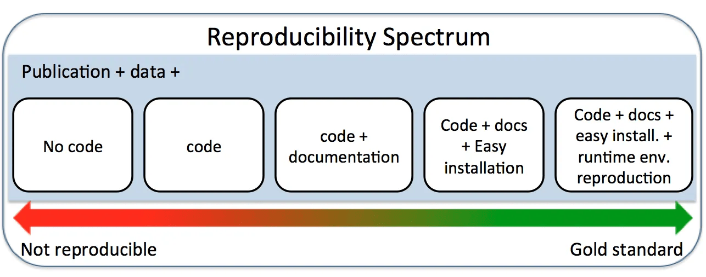

::: {.callout-note appearance="simple"}
## Learning Objectives
By the end of this part, you should be able to:

1. Understand the scope and impact of the reproducibility crisis in scientific research.
2. Differentiate between an author’s and a reader’s perspective of a research workflow.
3. Identify the technical friction points that hinder reproducibility.
4. Explain the concept of a dynamic document and the three essential requirements for the "Gold Standard" of reproducible research.
5. Identify core tools for managing package dependencies and computing environments (`renv`, `requirements.txt`, Docker).
:::

## Introduction

In modern research, an enormous and ever-increasing amount of data is collected across every field of science and engineering. To analyse these data, researchers deploy increasingly complicated algorithms, specialised software packages, AI models, and advanced statistical techniques. 

Data analysis workflows have become so intricate that if data analysts do not pay close attention to documenting the reproducibility of their data analysis, even they might have trouble reproducing their own reported results after just a few months. As the next generation of engineers and researchers, it is essential that you know how to make your data analysis and research 100% reproducible from the very beginning.

---

## Why Bother? The Reproducibility Crisis

Reproducibility is one of the most fundamental principles of the scientific method. 

Consider how regular people think versus how scientific researchers think. If a regular person touches a wire and gets an electric shock, their reaction is: *"I guess I shouldn't touch that part again."* However, for a researcher, the question is fundamentally different: *"I wonder if that happens every single time I touch it?"* As researchers, we want to discover underlying patterns, which inherently requires phenomena to be reproducible.

But is modern scientific research actually reproducible? Empirical data suggests a systemic problem:

* **Financial Waste:** Every year in the United States alone, **$28 billion** is spent on non-reproducible preclinical medical research.
* **Code Execution Failures:** 
  * **74%** of publicly available R scripts fail to run without throwing errors.
  * **97%** of public Python Jupyter Notebooks are not reproducible as documented.

### The *Nature* Survey on Reproducibility

The prestigious journal *Nature* conducted a massive survey of 1,576 researchers asking about reproducibility in their fields:

* More than **70%** of researchers reported that they have tried and failed to reproduce another scientist's experiments.
* More than **50%** have tried and failed to reproduce **their own** previous experiments.
* When asked if there is a "reproducibility crisis," **52%** said "Yes, a significant crisis," and **38%** said "Yes, a slight crisis." In total, over 90% of participating scientists believe we are facing a reproducibility crisis.

---

## The Workflow Disconnect: Author vs. Reader

To understand why this crisis occurs, we must contrast the typical workflow of a research project from two opposite viewpoints.

### The Author's Perspective (Forward Process)

When undertaking a research project, an author moves forward through distinct stages:

1. **Study Design:** Formulate hypotheses and tasks.
2. **Data Collection:** Gather raw, synthetic, or empirical data.
3. **Data Processing:** Clean data, impute missing values, and re-format variables.
4. **Data Analysis & Modelling:** Develop models, calibrate, and validate.
5. **Documentation:** Generate output tables, figures, and discussions. 
6. **Publication:** Authors carefully select the "best" figures and tables (those that most clearly support their hypotheses) and compile them into a single static document (a PDF or Word file) to maximise the probability of publication.

### The Reader's Perspective (Reverse Engineering Process)

When a reader gets a copy of a published paper, they experience the workflow in reverse:

1. They start with the author's end product: the **static published paper**.
2. They attempt to **reverse-engineer** the study by extracting the mathematical models.
3. They try to infer the data cleaning and processing steps.
4. They attempt to reconstruct the raw data setup.

Because the author and reader perspectives flow in opposite directions, readers are forced to rely entirely on published text to infer what actually took place.

::: {.callout-warning}
## Common Misconception: Is it Malice or Technical Friction?
A natural question arises: *Are researchers hiding data or parameters on purpose?* 

While academic fraud exists, the vast majority of non-reproducibility stems from **systemic technical gaps** rather than malice. Even when authors share their raw data and scripts, subtle execution barriers prevent third-party reproduction:

* **Environment Mismatches:** If an author does not specify the exact R/Python version and the specific versions of user-contributed packages they used, running the code months later will frequently trigger error messages due to software updates.
* **Unstated Decision Thresholds:** Researchers routinely select arbitrary thresholds during data processing (e.g., filtering out certain outliers) or modelling (e.g., setting a significance level cutoff at $\alpha = 0.05$ vs. $\alpha = 0.01$). If these are not explicitly coded and documented, readers are forced to guess.
:::

---

## The Benefits of Reproducible Data Analysis

Making your data analysis and research 100% reproducible yields enormous benefits across three distinct levels:

1. **Benefits to the Author/Data Analyst:**
   * **Greater Impact:** Openly sharing code and data is one of the most effective ways to promote your research, increase your citation impact, and gain recognition from academic peers.
   * **Improved Work Habits:** It significantly improves your coding habits, documentation, and teamwork capabilities, while saving time during future paper revisions.
2. **Benefits to the Readers:**
   * **Trustworthiness:** Readers can instantly trust the quality and validity of the research they are reading.
   * **Extensibility:** Readers can use your reproducible code as a baseline and adapt it for further investigation on related topics without starting from scratch.
3. **Benefits to Society:**
   * **Stewardship of Public Goods:** Prevents academic misconduct, data fraud, and reporting scandals, ensuring taxpayer money is used effectively.
   * **Better Education Quality:** Imagine if all examples in engineering textbooks were 100% reproducible online. Students could download the dynamic code and reproduce exact tables and charts instantly.

---

## How to Achieve Reproducibility: Dynamic Documents

From a technical standpoint, the cornerstone of reproducible research is the **dynamic document**.

Historically, researchers used **Static Documents** (like MS Word or standard PDFs). The workflow involved doing analysis in software like R or Python, manually copy-pasting plots and tables into Word, and typing around them. Once generated, the content was fixed and disconnected from the underlying data.

A **Dynamic Document** (such as Quarto or R Markdown) solves this by combining three essential components into one single source file:

1. **Data**
2. **Source Code** (e.g., a computing language like R or Python)
3. **Narrative Text** (a markup language for documentation and textual interpretations)

Using tools like **Quarto**, you structure everything from the title and literature review to the data analysis and conclusions in one place. Your code is embedded directly inside the document as executable **code chunks**.

When you click the **Render** button, Quarto automatically performs two tasks:

* **Executes Code Chunks:** It runs all code chunks in a fresh, clean computational session, dynamically generating figures, tables, and numerical results.
* **Embeds Output:** It seamlessly inserts those generated results directly into the formatted report alongside your narrative text.

### Anatomy of a Minimal Dynamic Document

Below is a minimal example of a complete Quarto source file (`.qmd`). It contains a YAML metadata header, Markdown narrative text with inline code execution, and an executable R code chunk:

````markdown
---
title: "Concrete Strength Report"
author: "Jane Doe"
format: html
---

## Data Summary
We evaluated 5 concrete sample batches. The sample mean compressive strength 
was `r mean(c(32.4, 34.1, 31.8, 33.5, 35.0))` MPa.

```{r}
#| eval: false
#| label: fig-strength
#| fig-cap: "Compressive Strength by Batch"
strength <- c(32.4, 34.1, 31.8, 33.5, 35.0)
barplot(strength, names.arg = 1:5, xlab = "Batch", ylab = "Strength (MPa)")
```
````

When this document is rendered, Quarto executes `mean(...)`, calculates `33.36` MPa, generates the bar plot, and produces a single self-contained HTML or PDF report.

::: {.callout-important}
## Course Mandate: Assessment 1
For your first major assessment task in this course, **100% reproducibility is a strict requirement**. You must author your report using Quarto. Before submitting, you must click the Render button to verify that the document compiles without errors. The course teaching team will re-run every submitted Quarto document; if a document throws execution errors during rendering, marks will be deducted.
:::

---

## The Reproducibility Spectrum and Core Requirements

Reproducibility is not a simple all-or-nothing binary; it exists along a spectrum ranging from unrepeatable work to fully reproducible research (@fig-spectrum):

* **Not Reproducible:** Only a static publication (PDF/Word) is shared, with no code or data.
* **Code Available:** Code is published, but raw data are withheld or unavailable.
* **Code & Data Available:** Both scripts and raw data are published, but software versions or dependencies are unstated.
* **Gold Standard (Fully Reproducible):** Code, data, and the exact computational environment are specified and self-contained.

{#fig-spectrum width="80%"}

To achieve the "Gold Standard" of making your data analysis 100% reproducible, you must meet **three essential requirements**:

1. **Open-Source Scripts/Code:** Scripts for generating the entire paper (including data cleaning, models, figures, and tables) must be shared as a dynamic document using a free, open-source language.
2. **Open Data:** The raw datasets used in the paper must be openly shared on public repositories (e.g., GitHub, Zenodo, OSF).
3. **Software Environment Definition:** The exact software environment (operating system, software versions, and specific package dependencies) must be explicitly defined and reproducible.

### Practical Tools for Managing Environments and Workflows

To build a modern reproducible workflow, engineers rely on a structured suite of open-source tools:

* **Dynamic Document Engines:** Quarto, R Markdown, Jupyter Notebooks.
* **Programming Languages:** R, Python.
* **Package & Environment Managers:**
  * **R (`renv`):** The `renv` package creates a project-local library and records exact package versions in a `renv.lock` file, allowing anyone to restore the exact environment on another computer.
  * **Python (`venv` / `conda`):** Exporting a `requirements.txt` (via `pip freeze`) or `environment.yml` file records package versions for environment recreation.
  * **Containerisation (Docker):** Containers bundle the entire operating system, software versions, and dependencies into an isolated image, guaranteeing bit-for-bit computational reproducibility across platforms.
* **Version Control & Repository Storage:** Git, GitHub, Open Science Framework (OSF), Zenodo.

::: {.callout-tip}
## Summary
Transitioning to a reproducible workflow requires a slight learning curve upfront, but the long-term dividends for your research impact, personal efficiency, and scientific integrity are massive. Start your engineering projects in Quarto from day one!
:::