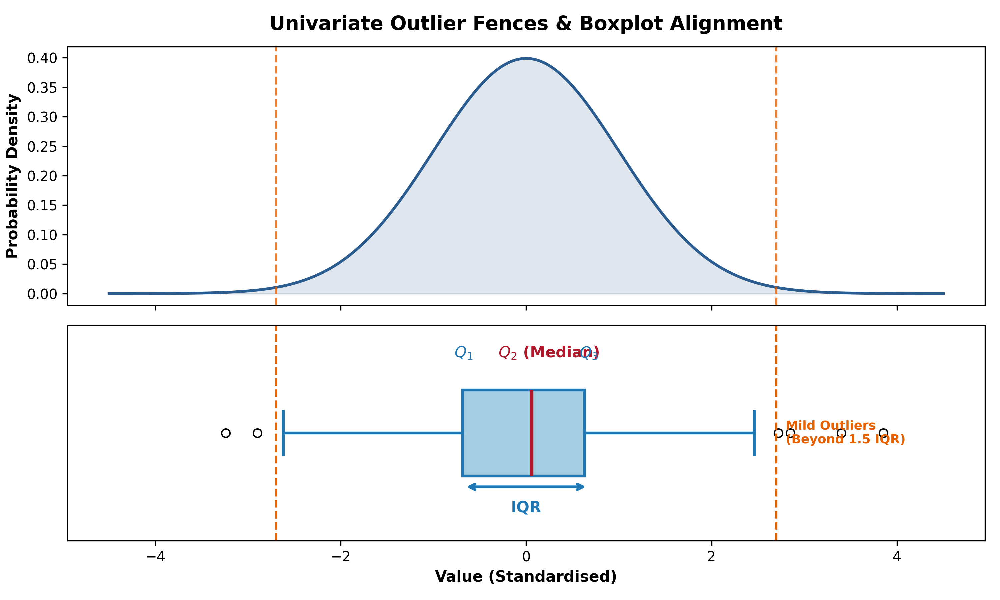
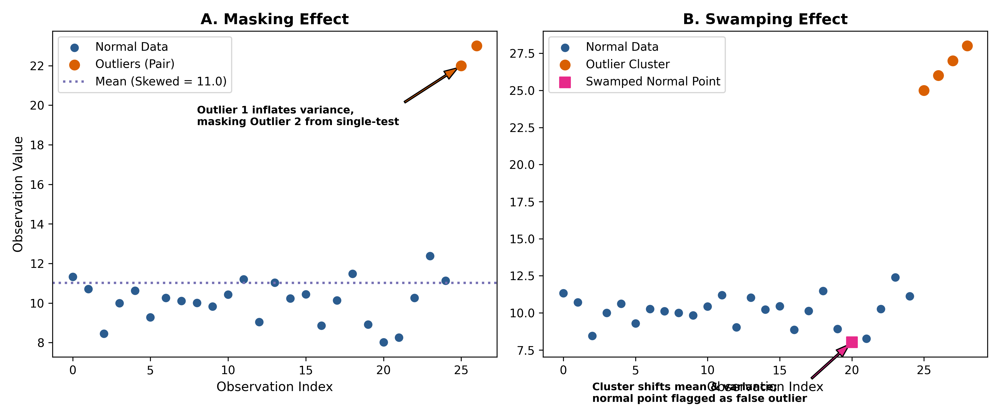
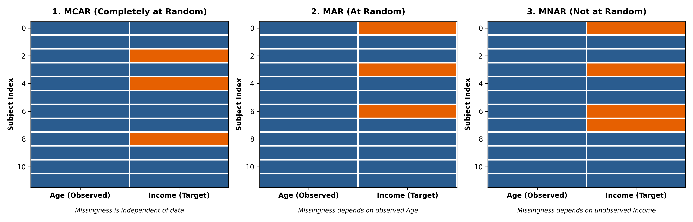
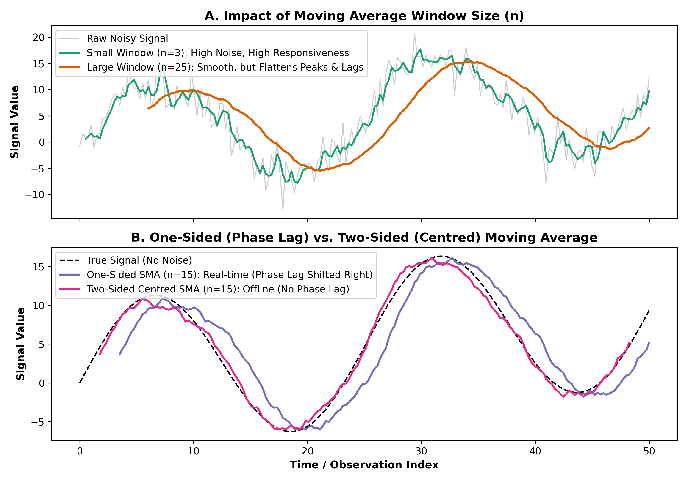

::: {.callout-note appearance="simple"}
## Learning Objectives

By the end of this chapter, you should be able to:

1. Understand the "Garbage in, garbage out" principle and the impact of data quality on statistical modelling.
2. Test for normality and detect outliers using visual tools and formal tests (Dixon's Q, Grubbs', and Rosner's tests).
3. Recognise the concepts of "Masking" and "Swamping" in outlier detection.
4. Classify missing data into three mechanisms (MCAR, MAR, MNAR) and evaluate appropriate treatments.
5. Apply data denoising techniques (Simple, Weighted, and Exponential Moving Averages), including one-sided vs. two-sided approaches and window size selection.
:::

## Introduction: "Garbage In, Garbage Out"

Before any statistical analysis can begin, data must be properly inspected. Data collected from the real world is rarely error-free; it is commonly plagued by missing values, measurement noise, and extreme outliers. If you start your analysis with a dataset plagued by unaddressed flaws, no statistical method, regardless of how advanced, will be able to produce reliable or valid insights. 

::: {.callout-warning}
## Case Study: The 100-Year Search for "Planet X"

In the 19th century, astronomers noticed slight perturbations in the orbit of Uranus, leading them to search for a massive "Planet X" beyond Neptune. Pluto was discovered in 1930 and incorrectly assumed to be this planet. Why did the orbital anomalies exist? In 1993, astronomer Myles Standish used Voyager 2 spacecraft data to recalculate Neptune's mass. Historical ground-based estimates were wrong by just **0.5%**. When the correct mass was used, the orbital anomalies of Uranus vanished entirely. For over a century, astronomers chased a ghost planet caused entirely by **data noise and measurement error**.
:::

---

## Detecting and Treating Outliers

Outliers represent extreme departures from the main body of data. If left untreated, they can disproportionately dominate fitted regression models, distort true statistical relationships, and lead to biased predictions.

### Visual Detection and Normality Testing

The most common visual method for detecting univariate outliers is the **Boxplot**, which partitions data using quartiles ($Q_1$, $Q_2$ Median, and $Q_3$). The **Interquartile Range ($IQR = Q_3 - Q_1$)** covers the central 50% of observations. Fences are defined at $1.5 \times IQR$ (mild outliers) and $3.0 \times IQR$ (extreme outliers) beyond the upper and lower quartiles (@fig-boxplot-fences).

{#fig-boxplot-fences}

Before applying formal statistical tests for outliers, it is necessary to verify whether the underlying clean distribution is normally distributed, as most outlier tests rely on this parametric assumption. Visual checks like **Q-Q plots** assess whether data points align along a 45-degree reference line. Formally, normality is evaluated using the **Shapiro-Wilk test**, which offers superior statistical power for general sample sizes, or the **Kolmogorov-Smirnov (KS) test** when testing against a specific reference distribution.

### Formal Statistical Tests for Outliers

Formal hypothesis testing provides rigorous statistical criteria for identifying outliers. For smaller datasets ($3 \le n \le 30$), **Dixon's Q test** evaluates whether a single extreme value should be rejected. For larger samples ($n > 6$), **Grubbs' test** assesses whether the single value furthest from the sample mean is a statistical outlier. 

However, single-outlier tests face severe mathematical limitations when multiple outliers exist. Applying single-outlier tests iteratively introduces two major phenomena (@fig-masking-swamping):

* **Masking:** An extreme outlier increases the sample variance so severely that it hides (masks) the statistical significance of a second nearby outlier.
* **Swamping:** A cluster of extreme values heavily skews the sample mean and variance, causing the test to incorrectly classify normal observations as outliers.

{#fig-masking-swamping}

To overcome both masking and swamping, **Rosner's test** (the Generalised Extreme Studentized Deviate test) should be used when multiple outliers are suspected in datasets with at least $n=25$. Rosner's test evaluates up to a pre-specified upper bound ($k$) of potential outliers simultaneously.

### The Danger of Deleting Outliers

Deleting an outlier simply to improve a model's goodness-of-fit ($R^2$) constitutes data manipulation or cherry-picking. Outliers often convey essential real-world information.

::: {.callout-important}
## The Thanksgiving Turkey

Nassim Nicholas Taleb illustrates the danger of ignoring extreme events with the "Thanksgiving Turkey" analogy. A turkey is fed every day for 1,000 days. A naive model would predict a highly confident upward trend in its well-being. Then, the Wednesday before Thanksgiving arrives, bringing an extreme "outlier" event. If the model simply deleted this outlier, it would completely fail to represent reality. 

**Rule:** Only delete an outlier if you have adequate theoretical or material justification (e.g., a known sensor failure, or a physical impossibility like a vehicle density of 0 when volume is 2,500 veh/hr).
:::

---

## Missing Data Mechanisms

To address missing observations scientifically, we must understand the probabilistic mechanism behind why data is missing. The probability of missingness $P(M)$ depends on both the observed data ($X_{obs}$) and the unobserved missing values ($X_{mis}$). Missing data is classified into three standard mechanisms (@fig-missing-data-mechanisms):

{#fig-missing-data-mechanisms}

### Missing Completely At Random (MCAR)
Under MCAR, missingness is entirely independent of both observed and unobserved data:
$$ P(M \mid X_{obs}, X_{mis}) = P(M) $$
An example is a hardware glitch that randomly drops data packets. While MCAR reduces sample size and statistical power, it does not introduce systematic estimation bias.

### Missing At Random (MAR)
Under MAR, missingness depends systematically on observed variables ($X_{obs}$), but not on the unobserved missing value ($X_{mis}$) itself:
$$ P(M \mid X_{obs}, X_{mis}) = P(M \mid X_{obs}) $$
For instance, older survey respondents may be less likely to report income, but within given age brackets, missingness is random. Ignoring MAR introduces bias, but statistical imputation techniques can successfully correct for it by leveraging the observed covariates.

### Missing Not At Random (MNAR)
Under MNAR, missingness depends directly on the unobserved value itself:
$$ P(M \mid X_{obs}, X_{mis}) \neq P(M \mid X_{obs}) $$
For example, individuals with very high incomes may systematically opt out of answering income questions. MNAR represents the most challenging scenario for data analysts because standard imputation methods cannot correct the inherent selection bias without explicit models of the missingness process.

---

## Methods for Handling Missing Data

Handling missing data involves choosing between deletion strategies and statistical imputation methods, depending on the underlying mechanism.

### Deletion Strategies
**Listwise deletion** (complete case analysis) removes any row containing a missing value. While simple, it significantly reduces sample size and produces biased parameter estimates unless the data is strictly MCAR. Alternatively, **pairwise deletion** uses all available pairs of data for each specific bivariate calculation (such as correlation matrices). However, pairwise deletion leads to inconsistent sample sizes across calculations, invalidates standard error formulas, and can produce non-positive-definite covariance matrices.

### Imputation Methods
**Mean imputation** replaces missing values with the variable's overall sample mean. Although straightforward, mean imputation artificially reduces sample variance and distorts relationships between variables, rendering it invalid outside of strict MCAR conditions. For MAR data, modern workflows rely on advanced techniques such as Stochastic Regression Imputation and Multiple Imputation (e.g., MICE), which preserve the natural variance and uncertainty of missing values.

---

## Data Denoising: Moving Averages

Data noise consists of high-frequency disturbances or random variations superimposed on a true underlying signal. Because the precise noise component can rarely be isolated directly, **moving average** techniques (also known as rolling or running averages) are applied to smooth data series.

### The Sliding Window Procedure

A moving average operates by passing a window of fixed size $n$ across a time series of $K$ observations:

1. **Window Selection:** Define a window span of $n$ observations.
2. **Averaging:** Position the window over the data, calculate the arithmetic mean of the contained points, and output the smoothed value.
3. **Sliding:** Shift the window forward by one time step ($k \rightarrow k+1$) and repeat the process across the series.

The design of the window depends heavily on the operational application:

#### One-Sided vs. Two-Sided Windows
A **one-sided moving average** uses only current and historical observations up to time $k$. This formulation is mandatory for real-time online applications (such as telemetry processing or autonomous control) where future data points are unavailable. A trade-off of one-sided filtering is phase lag, which shifts trends forward in time.

In contrast, a **two-sided (centred) moving average** computes a symmetric window containing both past and future observations around time $k$. Centered averages eliminate phase lag and are widely used in offline batch analysis. To maintain central symmetry around $k$, two-sided windows require an odd window size $n$ (e.g., 3, 5, 7).

### Simple Moving Average (SMA)

The Simple Moving Average applies equal weighting ($w = 1/n$) across all points within the sliding window. For a one-sided SMA, the smoothed value $\bar{x}_k$ is expressed as:
$$ \bar{x}_k = \frac{1}{n} \sum_{i=0}^{n-1} x_{k-i} $$

When measurement noise behaves as pure Gaussian white noise, the SMA is mathematically optimal for minimising noise variance while preserving linear trends.

Selecting the window size $n$ involves a critical trade-off between smoothing and responsiveness (@fig-moving-average-smoothing):

* **Small windows** ($n=3$) maintain quick responsiveness to rapid structural changes but retain noticeable residual noise.
* **Large windows** ($n=25$) produce smooth output signals but flatten true signal peaks and introduce significant lag.

{#fig-moving-average-smoothing}

Selection of $n$ is guided by domain knowledge (e.g., 12-month windows for annual seasonality), empirical rules of thumb (10% to 25% of time-series length), or model selection criteria like AIC/BIC.

### Weighted Moving Average (WMA)

In many physical processes, recent observations carry more predictive relevance than distant historical points. The Weighted Moving Average addresses this by applying a non-uniform weight vector ($w_i$) that assigns greater emphasis to recent data:
$$ \bar{x}_k = \frac{\sum_{i=1}^{n} w_i x_{k-i+1}}{\sum_{i=1}^{n} w_i} $$

### Exponentially Weighted Moving Average (EWMA)

The Exponentially Weighted Moving Average (EWMA) is a first-order recursive filter widely used in real-time engineering. It updates the smoothed estimate $\bar{x}_k$ as a linear combination of the current raw observation $x_k$ and the previous estimate $\bar{x}_{k-1}$:
$$ \bar{x}_k = \alpha \bar{x}_{k-1} + (1 - \alpha) x_k $$
where $(1 - \alpha)$ represents the smoothing constant. Expanding this recursive relationship demonstrates that historical observations decay exponentially with age:
$$ \bar{x}_k = \alpha^n \bar{x}_{k-n} + (1-\alpha) \sum_{i=0}^{n-1} \alpha^i x_{k-i} $$

::: {.callout-note}
## The SpaceX Starship Analogy: The Computational Power of EWMA

Why is EWMA revolutionary for real-time control algorithms? Imagine monitoring the flight trajectory of a SpaceX Starship during Mars atmospheric entry. Sensors stream telemetry data at thousands of readings per second. 
If the guidance algorithm used a standard SMA, it would need to store thousands of historical data points in RAM and mathematically sum them from scratch every millisecond. This would cause processing lag, potentially resulting in a crash.
With the EWMA recursive formula ($\bar{x}_k = \alpha \bar{x}_{k-1} + (1 - \alpha) x_k$), **you only need to store one single previous value ($\bar{x}_{k-1}$) in memory**. The computer executes one fast multiplication and addition, updates the value, and instantly discards the raw historical point. This eliminates computational delay and enables true real-time guidance.
:::

::: {.callout-tip}
## Software Implementation in R

When working on your data projects, R provides several powerful packages for calculating moving averages:

*   **Dedicated Time-Series Packages:** `TTR`, `zoo`, and `RcppRoll` offer highly optimised functions for computing simple, weighted, and exponential rolling averages.
*   **The `stats` Package:** Contains base R functions like `filter()` (for autoregressive and moving average linear filtering of multiple univariate time series), `spectrum()` (for spectral density estimation), and `smooth()` (for computing Tukey's running median smoothers).
:::
